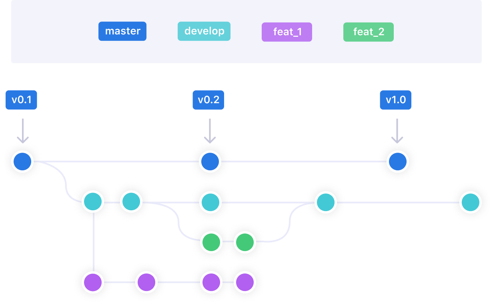

## 4. Branch Concept :-




**To create new branch :**

```bash
git branch <branch Name>
```

**To create new branch and point head to that branch :**

```bash
git checkout -b branchName
```

- **Example- branchName :** use branch name like `anuj/multiply` for convenient for all users on which you are working.

**To merge a branch to other branch :**

```bash
git merge anuj/multiply
```

- **Note :** Your head must point to another branch in which you want to merge.

**To ignore the files in git/github :**

```bash
touch .gitignore
```

- put the files name inside the `.gitignore` for ignore that file to track the git in `.git` file.

**To check how many branch :**

```bash
git branch
```


-----------------> Kunal


## 5. What is Branch ?

1. What is branches ?

2. What is merging branches ?


- Brach is used for working on feature in separate code from other's code.

- Whenever you working on some other feature or resolving a bug always create a separate branch. Never commit on main branch & create our first pull request.
- One Pull request = One branch, because after all commit added in that branch.
- For different pull request for different features create a new branch and pull on them.
- There may be so many branches but the main branch is the default branch, this is the one which is used by developers so that is the reason we never commit on main branch. Because our code that is not finalized yet might contains some errors. That is why all code that is not finalized that are you working on should go on separate branch so that user get not effected.
- [Learn Git Branching Concept](https://learngitbranching.js.org/)

__How to create a new branch :__

```bash
# git branch feature
git branch name
```

__How switch to another brach (now your head is pointing to other branch) :__

```bash
# git checkout feature
git checkout name
```

__How to merge a branch to main :__

- People say, my code is now finalized can you please merge this code into the main code.

```bash
# git merge feature
git merge name
```

### Questions :-

- How this merging happens ?
- How do we create new branches ?
- Why do we work with new branches ?
- Why everyone can work with the main branch ?
- How do we get new branch merged ?
- What is Pull Request ?