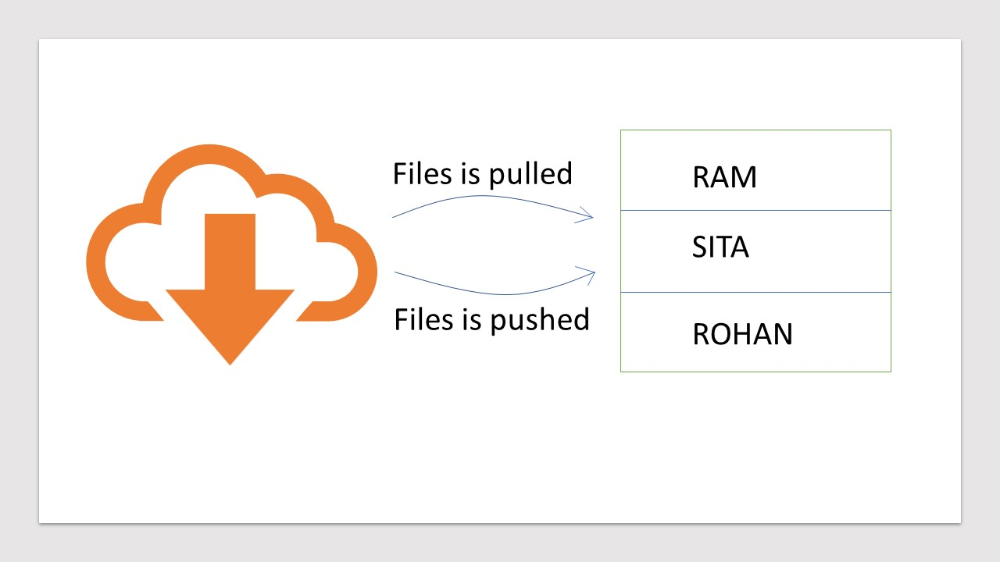
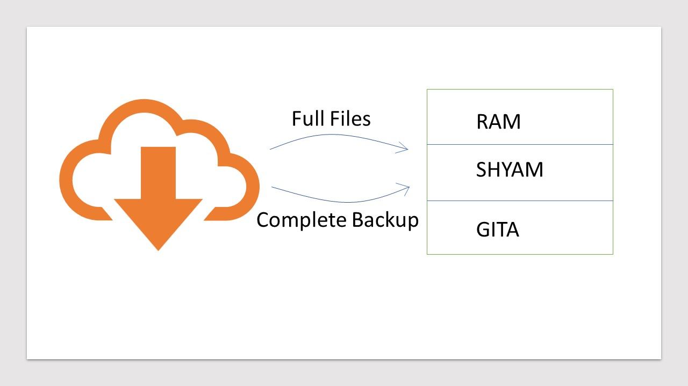

# What is Git?
* Git is a Version Control System.
    - Easily recover files.
    - Who introduce an issue and when?
    - Roll back to previously working state.
#### For Example :
* We work on a project in which all files of the project in a folder and you make changes in it time to time. And you want to track record of all your changes previous and present as like versions of software, these all kind of changes saves the Git.

##### Note :
* Not a good way to save all files in your system, they take memory space and difficult to arrange in your computer system.

     -->  -->  -->  --> 
    * If these files stores 2GB then it takes lots of memory.

## History of VCS :
### Local VCS :
* Data Base use to keep track of files.

### Centralized VCS :

### Decentralized VCS :
