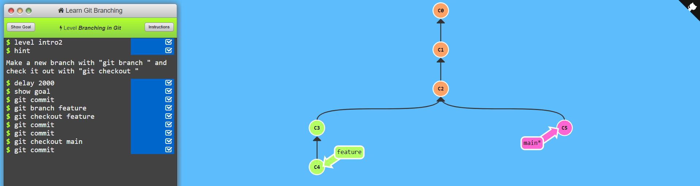
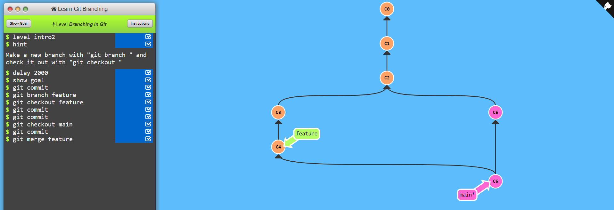

# Use Cases :
* You want to collaborate with other people.
* Want to add more feature on your projects.
* Want to go previous versions of your projects (basically saving the history of your projects).
* You want to contribute in open source or in a project.

# Git Setup :
### To check your Git Version :
    git --version

### To set your configuration of your account :
    git config --global user.name "Your Name"
    git config --global user.email "yourmail@gmail.com"

### To check your account information :
    git config --global user.name
    git config --global user.email

### To change your information :
    git config --global --edit

### To exit from editor in git :
* `Esc` + `:` + `wq`

# Git Tutorial
### How to check whats going in present working directory or show the all changes in present? :
    git status

### How to put all new files which is untracked into .git for tracking? :
    git add .
### OR To add individually file by name into staging area? :
    git add file.name

### How to capture a snapshot of your work or to save your work? :
    git commit -m "your message"

### How to get back unstage from staged without having commit? :
    git restore --staged name.txt

### where you can see all commit that made in history? :
    git log

### How to remove a commit from the history copy the hashID from (git log) :
    git reset paste_hashID

#### Note :
* You can't remove a commit from middle.
* All above commit will remove where you reset.

### How to go in previous commit ou changes without commit and also don't want to loose present change : (Back in the project)
    git stash

### How to come back that changes (i.e. backstage) : popping stash
    git stash pop

### How to clear stash which is commit : clearing stash
    git stash clear

### How to connect a new remote repository with your folder (local repository) :
    git remote add origin https://url

### How to check all url attached to your folder :
    git remote -v

### How to push local changes to remote repository :
    git push origin master

# What is branch? :
* Branch :

* Merge Branch :

### How to create a new branch :
    git brach name

### How switch to another brach : (now your head is pointing to other branch)
    git checkout name

### How to merge a branch to main :
    git merge name

#### Note :
* Whenever you working on some other feature or resolving a bug always create a separate branch. Never commit on main branch &create our first pull request.
* One Pull request = One branch, because after all commit added in that branch.
* For different pull request for different features create a new branch and pull on them.

# Working with existing project on GitHub : (Forking)
* By Forking you take all project on your account

### How to clone a repository (the forked project to local) :
    git clone https://url

#### Note :
* If your repository of your account name of that is going to be origin.

# What is Upstream URL :
* From where you have fork the project that is known as Upstream URL

### How to add Upstream URL :
    git remote add upstream https://url

* You are ready to pull request.

### How to push code of a branch of your account to upstream repository : (i.e. Pull request)
#### Note : You are able to push on upstream url like (git push upstream branchName) instead of this you have to do-
    git push origin branchName

* Then you need to pull request from `pull request` section in GitHub.

### When online repository contain a commit that local does not contain that commit then you have to force push :
    git push origin name -f

### How do you make sure main branch of the Upstream and your own forked main branch always maintain for that : (Fetch Upstream)
#### Note : You can use Fetch upstream from GitHub
    git checkout main
    git fetch --all --prune
    git reset --hard upstream/main
    git log
    git push origin main

#### OR another way :
    git pull upstream main
    git log
    git push origin main

#  Squashing Commits :

### How to merge all of commit into one commit :
* One way to do that is -> reset FirstHashID-> stash -> again commit.
* Use rebase :
    * Copy Last Commit Hash ID

            git rebase -i PasteHashID
    * Then you are able to squash or pick.
    * So which you want to merge write (all squash commit are added into above pick commit) -> s
    * Or you want to leave that commit as it is -> pick
    * To edit the commit message : `Esc` + `:` + `x`

# Merge Conflict :
* If Multiple user modified same line number then git will confused.
* Go to GitHub and compare and merge that conflict manually via edit which changes you want to take.

# < The End >